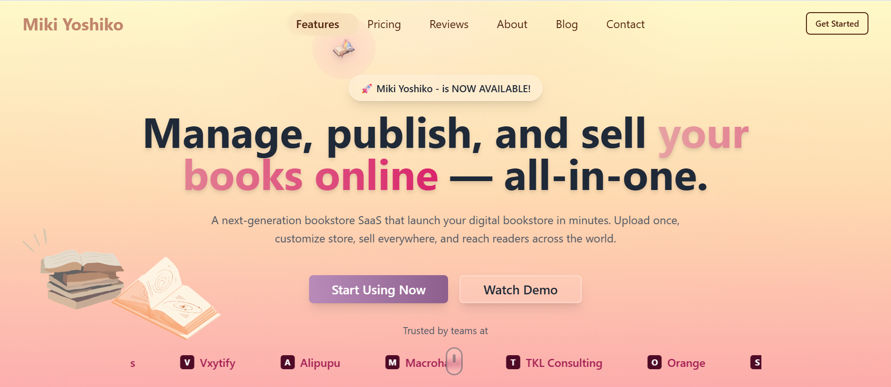
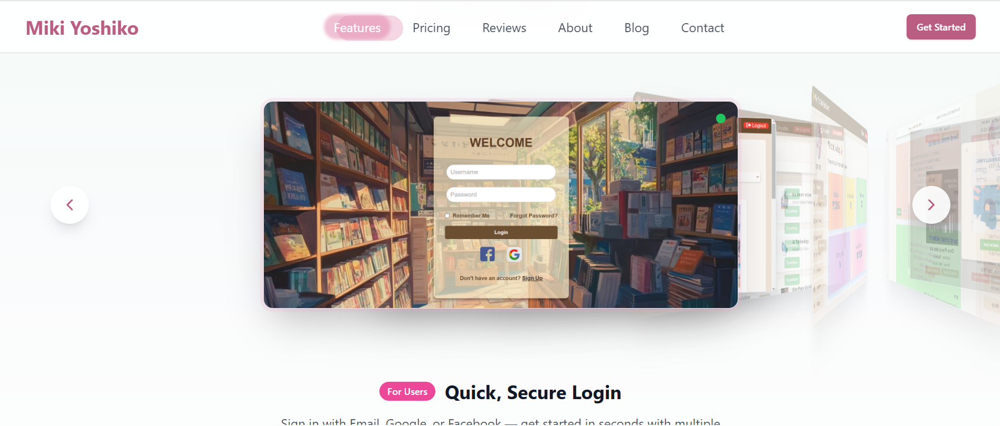
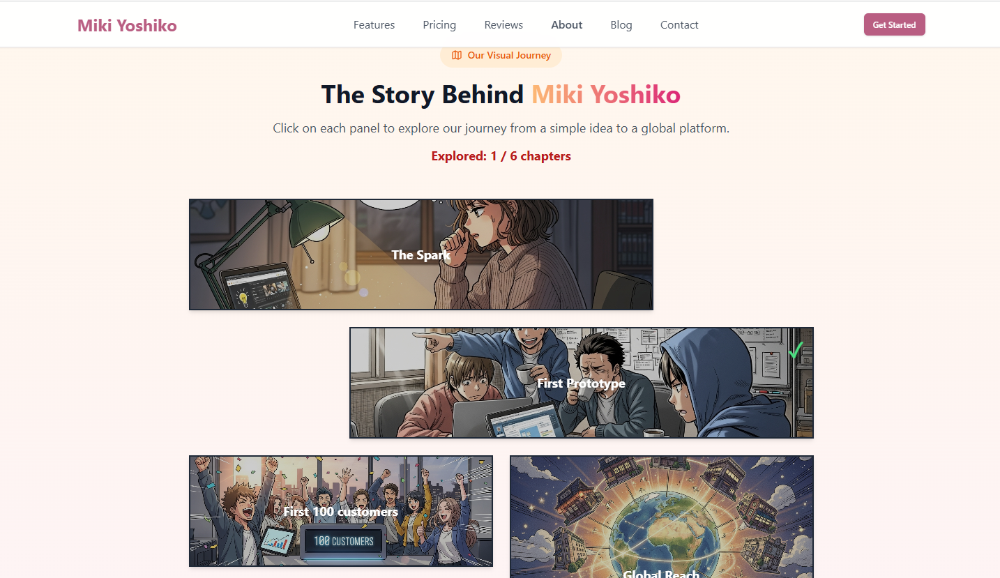
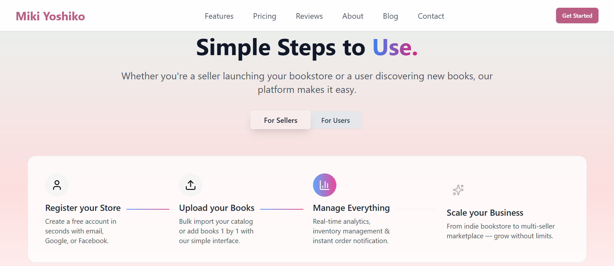
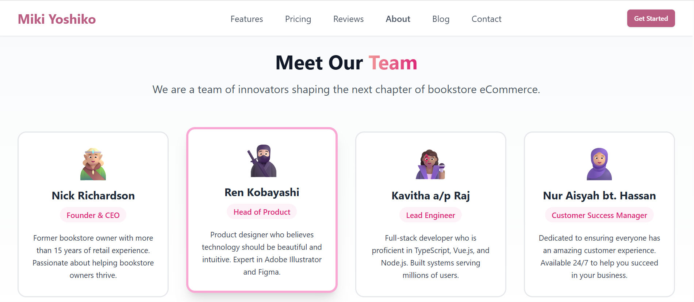
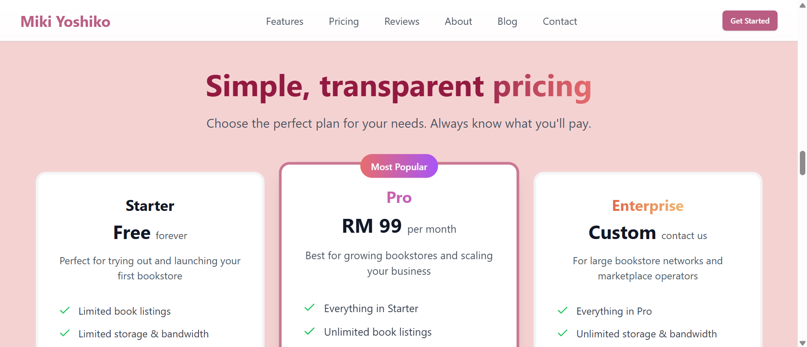
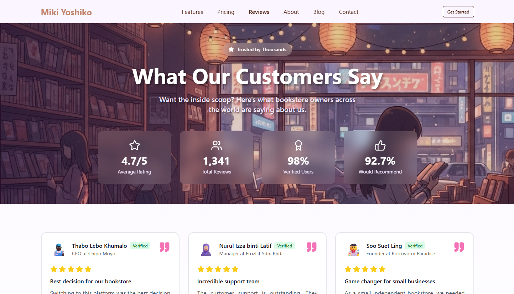

<div align="center">
  
  
  # Miki Yoshiko - Landing Page Design
  
  <p>
    <strong>A modern, visually stunning SaaS business landing page with advanced UI/UX design.</strong>
  </p>

  <p>
    
    
    
    
    
    
  </p>

  <p>
    
    
    
    
  </p>

  <p>
    <a href="https://kaifeng-cmd.github.io/lunaria/">View Demo</a> •
    <a href="LICENSE">License</a>
  </p>





</div>

## 📖 About The Project

**Miki Yoshiko** is a modern and elegant business landing page designed for SaaS products and digital platforms. This project showcases a balance between aesthetic design principles and scalable frontend architecture, offering a flexible foundation for future business use cases. It follows modern web development practices and advanced UI/UX features.

### 🎯 Project Goals

- **Design Excellence**: Create a visually compelling landing page with smooth animations and transitions
- **Template Customization** – The design and components can be easily adapted to match different industries or brand identities, making it an excellent starting point for future SaaS, marketing or company specific websites.
- **Scalable Frontend Architecture** – Developed using `Vue 3` Composition API, `TypeScript`, and a component-driven structure for maintainability and reusability.
- **DevOps Integration**: Implement CI/CD pipeline using `GitHub Actions` for automated `GitHub Pages` deployment.
- **Reusability**: Build modular, reusable components following best practices.

> **Note**: This is a **portfolio/showcase project** with mock data. It serves as a demonstration of UI/UX and frontend development.

## 🛠️ Tech Stack

### Core Framework

| Technology     | Purpose                    |
| -------------- | -------------------------- |
| **Vue.js**     | Frontend framework         |
| **TypeScript** | Type-safe development      |
| **Vite**       | Next-generation build tool |
| **Vue Router** | Page routing               |

### Styling & UI

| Technology       | Purpose                     |
| ---------------- | --------------------------- |
| **Tailwind CSS** | Utility-first CSS framework |
| **Shadcn-vue**   | UI components (Vue ver.)    |
| **Lucide Icons** | Icon library                |

### Code Quality & DevOps

| Technology         | Purpose               |
| ------------------ | --------------------- |
| **ESLint**         | JS/TS linting         |
| **Prettier**       | Code style formatting |
| **GitHub Actions** | CI/CD pipeline        |
| **GitHub Pages**   | Static site hosting   |

## 📸 UI Screenshots

Below shows some of the screenshots of the landing page design, for live app pls refer to <a href="https://kaifeng-cmd.github.io/lunaria/">here</a>.

<details>
<summary>Click to expand</summary>


_Guide exploration_


_Team members of top management_


_Pricing cards with feature comparison_


_Customer reviews with ratings_

</details>

## 😺 Installation

### Prerequisites

Please refer to <a href="package.json">Requirements</a>

### Quick Start

1. **Clone the repository**

   ```bash
   git clone https://github.com/kaifeng-cmd/lunaria.git
   cd lunaria
   ```

2. **Install dependencies**

   ```bash
   npm install
   ```

3. **Run development server (Local)**

   ```bash
   npm run dev
   ```

   Navigate to `http://localhost:5173`

4. **Build for production (Optional)**

   For the case u have other idea to handle for deployment. I used `deploy.yml` for CI/CD **[See Step 5]**.

   ```bash
   npm run build
   ```

5. **Production**

   I used `GitHub Actions` for CI/CD, deploy to `GitHub Pages`. Go to your GitHub repos `Settings` > `Pages` > `GitHub Actions` to enable the auto deployment.

## 🤝 Contributing

While this is primarily a portfolio project, feedback and suggestions are welcome! Especially you have good UI design ideas!

### How to Contribute

1. Fork the repository
2. Create a feature branch (`git checkout -b feature/AmazingFeature`)
3. Add to stages (`git add .`)
4. Commit your changes (`git commit -m 'feat: Add some AmazingFeature'`)
5. Push to the branch (`git push origin feature/AmazingFeature`)
6. Open a Pull Request

### Study & Learn

Feel free to:

- **Fork** this repo to experiment with different UI design
- **Study** the component structure and design patterns
- **Adapt** the color schemes and layouts as templates for your own project
- **Reference** the animation techniques in your work

## 📝 License

This project is licensed under the **MIT License** - see [LICENSE](LICENSE) for details.

## 🙏 Acknowledgments

- **[Shadcn Vue](https://www.shadcn-vue.com/)** - Thanks unofficial community-led for the Vue port of shadcn/ui.
- **[Google AI Studio](https://aistudio.google.com/)** - For the source of AI-generated images (via Imagen 4 & Nano Banana).

---

<div align="center">
  <p>If you found this project helpful, please consider giving it a ⭐️</p>
</div>
